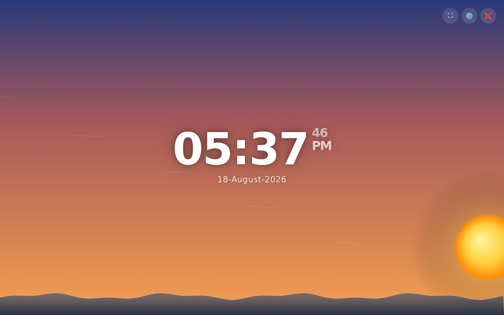
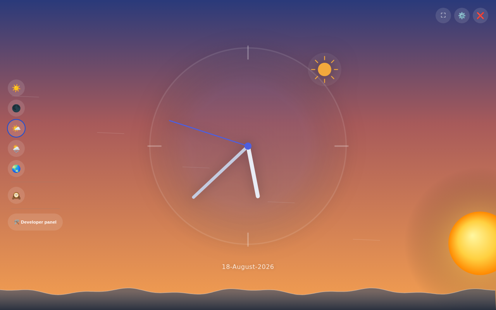

# Clock Overlay

A drop-in, full-screen idle clock overlay for any website — a digital or analog clock, a living sky with weather-driven atmospheric effects, and a photorealistic 3D sun/moon, in **two files** you can `<script>`-tag into any page.


<p align="center">
  
  
</p>

## Features

- **Five clock faces** — digital, big digital, analog, big analog, and a hybrid analog+digital view, switchable from an on-screen picker.
- **Four color themes** — light, dark, and two animated "live sky" themes (color and grey) that track real time of day.
- **A living sky** — clouds, rain, breeze, thunder, snow, fog, ocean waves, and a starry night, each toggleable from a circular ring menu. Defaults auto-adjust based on real weather conditions when available.
- **3D sun & moon** — a Three.js-rendered, texture-mapped, correctly-phased moon and a plasma-shaded sun, draggable to rotate, with a seamless flat-2D fallback if WebGL or the CDN is unavailable. Nothing ever breaks — it just looks a little simpler.
- **Real weather + AQI** — auto-fetched from free, keyless public APIs ([ipwho.is](https://ipwho.is) for geolocation, [open-meteo.com](https://open-meteo.com) for weather and air quality). Fails silently if blocked; never shows an error to visitors.
- **Idle auto-open** — the overlay opens itself after a configurable period of no scrolling, and a small public API lets you trigger it manually from anything on your own page.
- **A developer panel** — one visible button away, showing live API health, a manual time-override slider (scrub to any hour and watch the sky/sun/moon follow), and 3D-renderer diagnostics.
- **Zero build step** — no bundler, no npm install, no framework. Just static files.

## Quick start

1. Copy `clock-overlay.js` and `clock-overlay.config.js` into your project (optionally `moon-map.jpg` / `sun-map.jpg` too, for the textured 3D sun/moon — see [Sun & moon textures](#sun--moon-textures) below).
2. Include the config file **before** the engine file, on every page you want the overlay on:

   ```html
   <script src="clock-overlay.config.js"></script>
   <script src="clock-overlay.js" defer></script>
   ```
3. That's it. The overlay wires itself up automatically and opens after the configured idle timeout.

Want to see it working first? Open `demo.html` directly in a browser (just double-click the file — no server needed) and click **"Open clock now"**.

## Files

| File | What it is |
|---|---|
| `clock-overlay.js` | The engine. Styles, DOM, clock rendering, sky effects, idle logic, developer panel. You shouldn't need to edit this. |
| `clock-overlay.config.js` | Your settings. Idle timeout, default theme, starting sky effects, texture paths. Edit this one. |
| `demo.html` | A standalone example page. Works offline, no server required. |
| `moon-map.jpg` / `sun-map.jpg` | Optional equirectangular textures for the 3D sun/moon. Omit them and the overlay falls back to a flat, phase-shaded 2D disc automatically. |

## Configuration

Everything lives in `clock-overlay.config.js` as a plain object:

```js
window.ClockOverlayConfig = {
  idleTimeoutMs: 3 * 60 * 1000,   // how long to wait before auto-opening
  startMinimized: true,           // settings panel starts collapsed
  defaultColorTheme: 'live',      // 'light' | 'dark' | 'live' | 'grey'
  defaultClockTheme: 'digital',   // 'digital' | 'digital-big' | 'hybrid' | 'analog' | 'analog-big'
  skyEffects: {                   // starting state of each sky effect
    master: true, cloud: false, rain: false, breeze: true,
    thunder: false, snow: false, fog: false, wave: true, night: true
  },
  enableWeather: true,            // auto-fetch weather + AQI
  celestialSize: 1.2,             // 2D sun/moon glow size multiplier
  celestialSizeMult: 2,           // 3D sun/moon sphere size multiplier
  moonTextureUrl: 'moon-map.jpg',
  sunTextureUrl: 'sun-map.jpg'
};
```

Every field is optional — delete anything you don't want to change.

## Public API

There's no hidden gesture or secret tap sequence to open the overlay manually — wire up your own button, keyboard shortcut, or event to:

```js
ClockOverlay.show();               // open the overlay
ClockOverlay.hide();               // close it
ClockOverlay.toggle();             // open/close
ClockOverlay.openDeveloperPanel(); // jump straight to the developer/diagnostics panel
```

## Sun & moon textures

The 3D sun/moon looks best with real equirectangular texture maps (`moon-map.jpg`, `sun-map.jpg`), but they're not required — if they're missing, blocked, or WebGL/Three.js can't load, the overlay automatically falls back to a flat, correctly phase-shaded 2D disc. Nothing breaks; it just renders more simply. Drop your own texture files in and point `moonTextureUrl` / `sunTextureUrl` at them if you want the full 3D look.

## Browser support

Any modern evergreen browser (Chrome, Edge, Firefox, Safari). The 3D sun/moon needs WebGL; everything else — clock, themes, sky effects, weather, developer panel — works without it.

## License

MIT — see [LICENSE](LICENSE).

Built by [Vijay Parmar](https://linkedin.com/in/thevijayparmar).
